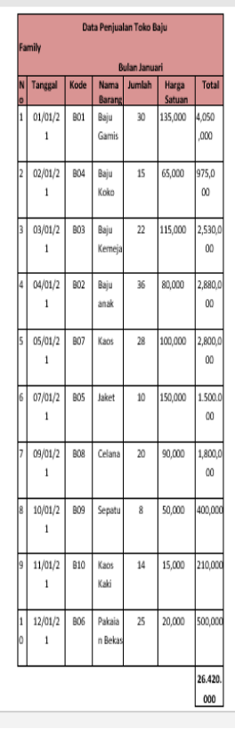
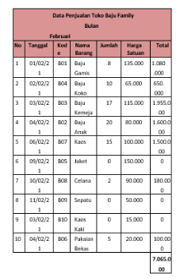
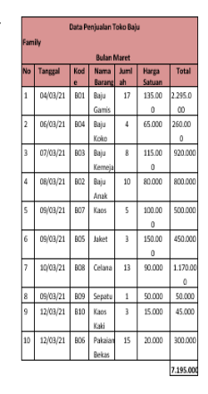
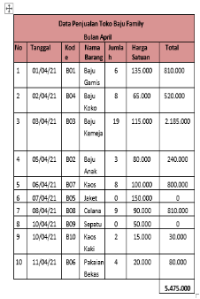
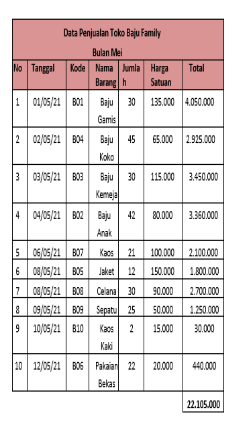
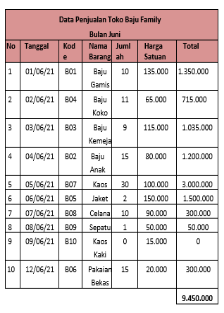
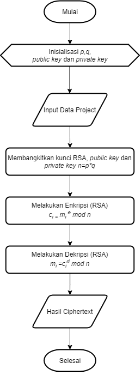
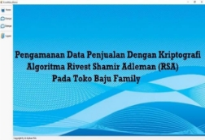
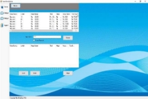
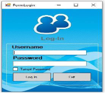

**Journal of Science and Social Research**                           ISSN 2615 – 4307  (Print) Oct 2022, V (3): 664 – 670                  ISSN 2615 – 3262  (Online) Available online at http://jurnal.goretanpena.com/index.php/JSSR ![ref1]

**PENGAMANAN DATA PENJUALAN DENGAN KRIPTOGRAFI ALGORITMA RIVEST SHAMIR ADLEMAN (RSA) PAD** 

**A TOKO BAJU FAMILY** 

**Karina Andriani1, B.Herawan Hayadi2** 

**Universitas Potensi Utama, Medan** 

e-mail:[  andrianikarina@gmail.com**1  ](mailto:doasakti99@gmail.com1)**,** b.herawan.hayadi @gmail.com**2**  

***Abstract:** The development of computer technology at this time has a major impact in the delivery  of  information,  while  data  security  is  one  of  the  most  important  aspects  in today's  information  systems.  The  family  clothing  store  uses  computer  technology  to process sales transactions so that every transaction made is stored in the form of sales data. In the problems discussed, by implementing Data Security Application Design, one of them is by using the RSA (Rivest Shamir Adleman) algorithm in securing sales data. By securing sales data, it aims to assist employees in securing their sales data. The result of the research is the creation of a Data Security application with the RSA Algorithm (Rivest Shamir  Adleman)  which  can  assist  employees  in  securing  sales  data  at  the  Family Clothing Store.* 

***Keywords:** Cryptography, RSA (Rivest Shamir Adleman).* 

**Abstrak:** Perkembangan teknologi komputer pada saat ini memberikan dampak yang besar dalam penyampaian informasi, sedangkan keamanan data menjadi salah satu apek yang sangat penting dalam sistem informasi saat ini. Toko baju family menggunakan teknologi  komputer  dalam  melakukan  proses  transaksi  penjualan  sehingga  setiap transaksi yang dilakukan tersimpan dalam bentuk data penjualan.  

Pada permasalahan yang dibahas, dengan menerapkan Perancangan Aplikasi Keamanan Data salah satunya dengan menggunakan algoritma RSA (Rivest Shamir Adleman) dalam mengamankan  data  penjualan.  Dengan  mengamankan  data  penjualan  bertujuan  untuk membantu pegawai dalam mengamankan data penjualannya. Hasil penelitian merupakan terciptanya sebuah aplikasi Pengamanan Data dengan Algoritma RSA (Rivest Shamir Adleman)  yang  dapat  membantu  pegawai  dalam  mengamankan  data  penjualan  yang berada pada Toko Baju Family. 

**Kata kunci:** Kriptografi, RSA (Rivest Shamir Adleman) 

**PENDAHULUAN**  pencurian  atau  penyalahgunaan  yang dilakukan  oleh  pihak-pihak  yang  tidak 

Penjualan  adalah  suatu  tindakan  bertanggung  jawab.  Penyimpanan  data untuk  menukar  barang  atau  jasa  dengan  menggunakan  komputer  sebagai  upaya uang  dengan  cara  mempengaruhi  orang  pengamanan data, sehingga data-data atau lain  agar  mau  memiliki  barang  yang  informasi yang berharga dapat terjamin ke ditawarkan  sehingga  kedua  belah  pihak  rahasiaannya.  

mendapatkan keuntungan dan kepuasan.  Dalam  hal  ini  toko  baju  family 

Data  penjualan  merupakan  belum  memiliki  sistem  keamanan  pada informasi  yang  didapat  dari  kegiatan  data  penjualan  sehingga  data  penjualan transaksi penjualan pada suatu perusahaan  tersebut  rentan  terhadap  pencurian  dan melalui proses pemasaran.  Data  ataupun  manipulasi  data.  Maka  untuk  itu  perlu informasi adalah aset yang begitu penting  diperlukannya  pengamanan  data  yang bagi  suatu  perusahaan  ataupun  individu  kuat  dengan  menggunakan  algoritma dan  tidak  terlepas  dari  adanya  ancaman  kriptografi. 

**Journal of Science and Social Research**                           ISSN 2615 – 4307  (Print) Oct 2022, V (3): 664 – 670                  ISSN 2615 – 3262  (Online) Available online at http://jurnal.goretanpena.com/index.php/JSSR ![ref1]

Dalam  bidang  kriptografi  terdapat dua  konsep  yang  sangat  penting  atau utama  yaitu  enkripsi  dan  dekripsi. Enkripsi adalah proses dimana informasi atau  data  yang  hendak  dikirim  diubah menjadi  bentuk  yang  hampir  tidak dikenali  sebagai  informasi  awalnya dengan menggunakan algoritma tertentu. Dekripsi  adalah  kebalikan  dari  enkripsi yaitu mengubah kembali bentuk tersamar tersebut  menjadi  informasi  awal.  Proses penyamaran  dari  plaintext  ke  ciphertext disebut enkripsi (encryption), dan proses pengembalian  dari  ciphertext  menjadi plaintext  kembali  disebut  dekripsi (decryption)  .  Untuk  melakukan  proses enkripsi  dan  dekripsi  dengan menggunakan  metode  algoritma  Rivest Shamir Adleman (RSA). 

Dalam  kriptografi,  RSA  adalah algoritma  untuk  enkripsi  kunci  public. Algoritma  ini  adalah  algoritma  pertama yang  diketahui  paling  cocok  untuk menandai  (signing)  dan  untuk  enkripsi salah satu penemuan besar pertama dalam kriptografi kunci public. 

**METODE** 

Metode  pengembangan  sistem secara  umum  diartikan  sebagai  urutan langkah- langkah yang terstruktur untuk mengembangkan sebuah sistem informasi berbasis  komputer.  Metode pengembangan sistem juga dapat berarti menyusun  suatu sistem yang baru untuk menggantikan  sistem  yang  lama  secara keseluruhan atau mengembangkan sistem yang telah ada. Berikut beberapa langkah yang dilakukan dalam penelitian: 

ObservasiMelakukan  observasi langsung  di  Toko  Baju  Family  untuk mencari  masalah  yang  dialami  di  took tersebut  untuk  mengatasi  pemgamanan pada  data  penjualan.  Masalah  tersebut akan diselesaikan dalam penelitian ini. 

Wawancara  dilakukan  kepada pihak  yang  menangani  bagian  data penjualan. Adapun data yang didapatkan dari  hasil  observasi  dan  wawancara sebagai berikut: 

**Tabel. Data Penjualan Toko Baju Family Bulan Februari** 

**Journal of Science and Social Research**                           ISSN 2615 – 4307  (Print) Oct 2022, V (3): 664 – 670                  ISSN 2615 – 3262  (Online) Available online at http://jurnal.goretanpena.com/index.php/JSSR ![ref1]

**Tabel. Data Penjualan Toko Baju Family Bulan Februari** 

**Tabel. Data Penjualan Toko Baju Family Bulan Maret** 

**Tabel. Data Penjualan Toko Baju Family Bulan April** 

**Tabel. Data Penjualan Toko Baju Family Bulan Mei** 

**Journal of Science and Social Research**                           ISSN 2615 – 4307  (Print) Oct 2022, V (3): 664 – 670                  ISSN 2615 – 3262  (Online) Available online at http://jurnal.goretanpena.com/index.php/JSSR ![ref1]

**Tabel. Data Penjualan Toko Baju Family Bulan Juni** 

Flowchart Algoritma Rivest Shamir Adleman  (RSA)  Dibawah  ini  adalah *flowchart*  proses  enkripsi  dan  dekripsi dari  algoritma  *Rivest  Shamir  Adleman* (RSA) sebagai berikut: 

Perhitungan  Metode  RSA  Perhitungan Metode  RSA  ini  merupakan  langkah- langkah penyelesaian masalah keamanan data penjualan pada Toko Baju Family: Proses pembangkit Kunci Proses enkripsi algoritma Rivest Shamir Adleman (RSA) adalah sebagaiberikut: 

Pilih dua bilangan prima sembarang  

dan  ,  G  . 

Nilai ( ) = 19 dan nilai ( ) = 7. 

Hitung  =  \*  . Bilangan  disebut *parameter.* 

p \* q = n 

*19 \* 7 = 108* 

Hitung Hitung  ( )  =  (  −  1)( –  1). 

( − 1)( − 1) =  ( ) 

(19-10)(7-1)=  ( ) 

(18)(6)=108 

Pilih  nilai  *e*  dengan  syarat  *e*  >  1  dan *greatest comman divisior* (*e,108*) = 1Nilai *e* yang di ambil adalah 7. 

Hitung *d*  hingga *d*,*e* ≡ 1 (mod 108) dan *d* 

*<* 108 

* 7  =  1  108 
* 7  108  = 1 

=  31 

jadi, 31 \*  7  108  =  1 

Sehingga  pasangan  kunci  yang  didapat adalah: 

Kunci  enkripsi  (*public  key*)  (*e,n*)  = (7,133) dan Kunci *dekripsi (private key)* (*d,n*) = (31, 133). 

Proses *Enkripsi* Pertama yang harus dilakukan  adalah  merubah  plaintext menjadi format ASCII, Berikut ini adalah penyelesaiannya: 

|*Plaint ext* |B |a|`  `j |u |Spas i |G |a |m|`  `i |
| :- | - | - | - | - | :-: | - | - | - | - |
|ASCII |66|`  `9 7|10 6 |11 7 |32 |71|`  `97|`  `10 9 |10 5 |

Kemudian *m* dipecah menjadi tiap karakter  *plaintext.*  Berikut  ini  adalah tabel: 

**Journal of Science and Social Research**                           ISSN 2615 – 4307  (Print) Oct 2022, V (3): 664 – 670                  ISSN 2615 – 3262  (Online) Available online at http://jurnal.goretanpena.com/index.php/JSSR ![ref1]

**Gambar .*Flowchart* Sistem Algoritma RSA** 

**Journal of Science and Social Research**                           ISSN 2615 – 4307  (Print) Oct 2022, V (3): 664 – 670                  ISSN 2615 – 3262  (Online) Available online at http://jurnal.goretanpena.com/index.php/JSSR ![ref1]

**Tabel.  Karakter  *mi*  dan  kode  ASCII** 

**untuk *plaintext* baju gamis** 

|***Mi*** |**Keterang an** |
**Kode ASCI I** 

**(desi mal)** 
|
| - | :-: | :-: |
|*m1* |B |66 |
|*m2* |a |97 |
|*m3* |j |106 |
|*m4* |u |117 |
|*m5* |Spasi |32 |
|*m6* |G |71 |
|*m7* |a |97 |
|*m8* |m |109 |
|*m9* |i |105 |
|*m10* |s |115 |

Selanjutnya  di*enkripsi*  dengan  *ci*  =  *mie mod n*, yaitu sebagai berikut:  

*Ci*  =  *mie mod n* 

*c1  =*  667  mod 133  = 80 

*c2*  =  977  mod 133  = 90 *c3*  =  1067 mod 133  = 106 *c4*  =  1177 mod 133  = 40 *c5*  =  327  mod 133  = 67 *c6*  =  717  mod 133  = 22 *c7*  =  977  mod 133  = 90 *c8*  =  1097 mod 133  = 60 *c9*  =  1057 mod 133  = 91 *c10*  =  1157 mod 133  = 115 

**Tabel. Karakter *Ci* dan Kode untuk *Plaintext* Baju Gamis yang telah    di*enkripsi*dengan algoritma *Rivest Shamir Adleman* (RSA)** 

|***C i*** |**Kode ASCII (decimal )** |**Kode ASCII (Hexadesimal)** |
| - | :- | :- |
|*c1* |80 |5 0 |
|*c2* |90 |5 a |
|*c3* |106 |6 a |
|*c4* |40 |2 8 |
|*c5* |67 |4 3 |

 

|*c6* |22 |1 6 |
| - | - | - |
|*c7* |90 |5 a |
|*c8* |60 |3 c |
|*c9* |91 |5 b |
|*c10* |115 |7 3 |

Maka,  dari  kata  “Baju  Gamis” menjadi  deret  karakter  Hexadesimal 505a6a2843165a3c5b73. 

Proses  Dekripsi  Selanjutnya  yang harus  dilakukan  adalah  merubah ciphertext menjadi format ASCII, Berikut ini adalah penyelesaiannya: 

|*cipher text* |50 |5a |6a |28 |43 |16 |` `5a|` `3c |5b |73 |
| :- | - | - | - | - | - | - | - | - | - | - |
|ASCII|` `80 |90 |106 |40 |67 |22 |90 |60 |91 |11 5 |

Kemudian  *ciphertext*  dipecah dalam dua karakter Hexadesimal. 

**Tabel. Karakter ci dan kode ASCII untuk ciphertext                 505a6a2843165a3c5b73.** 

|***Ci*** |**Kode ASCII (Heksadesinal )** |
**Kode ASCII** 

**(Desimal)** 
|
| - | :-: | - |
|*c1* |50 |80 |
|*c2* |5a |90 |
|*c3* |6a |106 |
|*c4* |28 |40 |
|*c5* |43 |67 |
|*c6* |16 |22 |
|*c7* |5a |90 |
|*c8* |3c |60 |
|*c9* |5b |91 |
|*c10* |73 |115 |

Kemudian  didekripsikan  kembali menggunakan  algoritma  Rivest  Shamir Adleman (RSA) dengan rumus *mi = c d mod n*, yaitu sebagai berikut: 

*m1 =* 8031 mod 133  = 66 *m2 =* 9031 mod 133  = 97 

*m3 =* 10631  mod 133  = 106 

**Journal of Science and Social Research**                           ISSN 2615 – 4307  (Print) Oct 2022, V (3): 664 – 670                  ISSN 2615 – 3262  (Online) Available online at http://jurnal.goretanpena.com/index.php/JSSR ![ref1]

*m4 =* 4031 mod 133  = 117  *user  name*  dan  *password*  dengan  benar. 

31 mod 133  = 32  Dibawah  ini  merupakan  tampilan  *form* 

*mm56 ==* 672231 *login* adalah sebagai berikut: 

mod 133  = 71 

**Gambar. *Form Login* Form Menu** *m7 =* 9031 mod 133  = 97  **Utam**a* 

*m8 =* 6031 mod 133  = 109 

*m9 =* 9131 mod 133  = 105  Menu utama merupakan *form* yang akan  menampilkan  menu  pada  sistem. 

*m10=* 11531  mod 133  = 115  Menu utama terdiri dari beberapa tombol yaitu  Menu  Enkripsi  dan  Dekripsi. 

Maka,  didapat  hasil  dari  dekripsi  yaitu: 66, 97, 106, 117, 32, 71, 97, 109,  105,115 dalam karakter ASCII adalah:  

|ASCI I |66 |97 |10 6 |11 7 |32 |71 |97 |10 9 |105 |11 5 |
| :- | - | - | - | - | - | - | - | - | - | - |
|*Plaint ext* |B |a |j |u |Sp asi|G |a |m |i |s |

**HASIL DAN PEMBAHASAN** 

Berikut adalah tampilan Menu Utama: 

`        `**Gambar .*Form* Menu Utama** Dalam  sistem  pengamanan  data 

penjualan ini di lengkapi dengan tampilan 

**Form Enkripsi** 

yang  bertujuan  untuk  memudahkan 

Form  enkripsi  digunakan  untuk penggunannya.  Fungsi  dari  antarmuka 

melakukan proses penyandian pada data. (*interface)* ini adalah untuk memberikan 

Berikut tampilan dari *form* enkripsi: input  dan  menampilkan  output  dari 

aplikasi.  Pada  aplikasi  ini  memiliko  

*interface* yang terdiri dari Menu Utama,  

Enkripsi dan Dekripsi.  

**Tampilan *Form Login***  

Sebelum  masuk  dan  mengakses  

` `**Gambar Form Menu Enkripsi **

**Form Dekripsi** 

*Form*  Deksripsi  digunakan  untuk melakukan proses penyandian pada data. Berikut tampilan dari *form* dekripsi: 

aplikasi,  *user*  harus  melakukan  *login* terlebih  dahulu  dengan  cara  meng-*input user  name*  dan  *password*  dengan  benar sesuai dengan sistem *database* dan akan masuk ke menu utama, namun jika tidak maka harus mengulangi untuk meng-*input* 

Administrasi Penjualan Pada Usaha Jaya  Teknika  Jakarta  Barat,” *Perspektif*, vol. 16, no. 1, pp. 26–30, 2018. S.  Setti,  I.  Gunawan,  B.  E. Damanik, S. Sumarno, and I. 

O.  Kirana,  “Implementasi Algoritma  Advanced Encryption  Standard  dalam 

**Gambar  Form Menu Dekripsi**  Pengamanan  Data  Penjualan Ramayana Department Store,” 

*JURIKOM  (Jurnal  Ris.* **SIMPULAN**  *Komputer)*,  vol.  7,  no.  1,  p. 182,  2020,  doi: 

Berdasarkan  Penelitian  yang  telah  10.30865/jurikom.v7i1.1960. dilakukan  dalam  tahap  perancangan  dan  F. N. Pabokory, I. F. Astuti, and evaluasi  implementasi  metode  Rivest  A.  H.  Kridalaksana, Shamir  Adleman  (RSA)  untuk  “Implementasi  Kriptografi pengamanan  data  penjualan  pada  Toko  Pengamanan Data Pada Pesan Baju  Family,  maka  dapat  disimpulkan  Teks, Isi  File Dokumen, Dan bahwa :  File Dokumen Menggunakan Berdasarkan  hasil  peneltian  yang  Algoritma  Advanced dilakukan sebelumnya dengan Algoritma  Encryption  Standard,” RSA  (Rivest  Shamir  Adleman)  maka  *Inform.  Mulawarman  J.  Ilm.* diterapkan  kedalam  sebuah  sistem  agar  *Ilmu Komput.*, vol. 10, no. 1, dapat mengenkripsi dan mendekripsi data  p.  20,  2016,  doi: penjualan  untuk  memperoleh  keamanan  10.30872/jim.v10i1.23. 

data penjualan pada Toko Baju Family.  I.  Gunawan,  “Kombinasi Berdasarkan  hasil  rancangan  aplikasi  Algoritma Caesar Cipher dan pengamanan  data  penjualan  dengan  Algoritma  RSA  untuk Algoritma RSA (Rivest Shamir Adleman)  pengamanan  File  Dokumen dirancang  dengan  pemodelan  UML  dan Pesan Teks,”  *InfoTekJar* (Unified  Modeling  Language),  yaitu  *(Jurnal  Nas.  Inform.  dan* aplikasi yang digambarkan pada Use Case  *Teknol. Jaringan)*, vol. 2, no. Diagram,  Activity  Diagram  dan  Class  2,  pp.  124–129,  2018,  doi: Diagram.  Kemudian  dilakukan  10.30743/infotekjar.v2i2.266. pengcodingan  dengan  perancangan  A.  P.  N.  Nurdin,  “Analisa  Dan berbasis dekstop.  Implementasi  Kriptografi Berdasarkan  hasil  pengujian  ini  Pada  Pesan  Rahasia,”  *Jesik*, 

maka pengamanan data penjualan dengan  vol. 3, no. 1, pp. 1–11, 2017, menerapkan  Algoritma  RSA  (Rivest  [Online].  Available: Shamir  Adleman)  diuji  dengan  cara  [nnurdin69@gmail.com. ](mailto:nnurdin69@gmail.com)

mengenkripsi  dan  mendekripsi  data  Wulandari and S. Aprilia, “Jurnal penjualan  sehingga  sistem  ini  mampu  TAM  (  Technology membantu pegawai dalam mengamankan  Acceptance  Model)  Volume data penjualan Toko Baju Family  4  Juli  2015,”  *Technol. Accept. Model*, vol. 4, pp. 1–

7, 2015. 

**DAFTAR PUSTAKA** 

Wijaya  and  R.  Irawan,  “Prosedur 

[ref1]: Aspose.Words.45a15ecf-6b11-44c5-a9f7-14cfabc3612b.001.png
